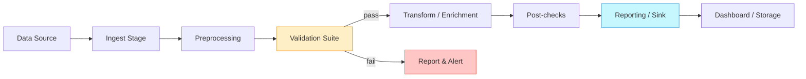
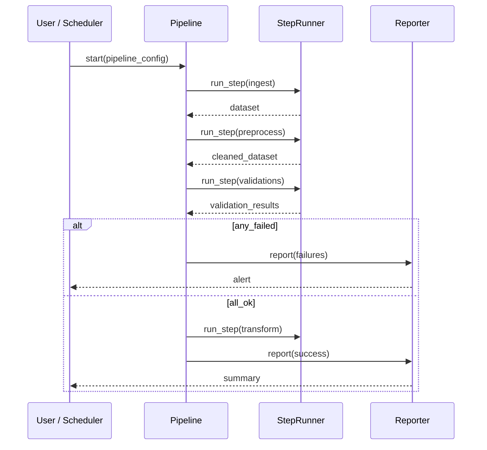

# Pipelines — DataQualityDecorators

[](#) [](#)

This directory contains pipeline components used to assemble, validate, and run data quality checks using the DataQualityDecorators framework.

Important: I attempted to read the files at `src/quality/pipelines` using the repository reference you supplied, but I couldn't fetch the file contents from the remote. The README below is a detailed, ready-to-use draft based on common pipeline patterns and the conventions used in DataQualityDecorators. Please paste the folder files or grant read access if you want me to adapt this README to the exact code and examples from your repo. Either way, you can copy this README directly into `src/quality/pipelines/README.md` and then tweak or replace the placeholders with project-specific names, examples, and screenshots.

Table of contents
- Overview
- Concepts & architecture (visuals)
- Typical files & responsibilities
- Quick start
- Example pipeline (code)
- Configuration & customization
- Testing pipelines
- Best practices
- Contributing
- FAQ

---

## Overview

Pipelines in this module orchestrate data quality checks and transformations as reusable, composable units. They typically:
- Compose validation checks built as decorators (from the core library).
- Provide a high-level API for wiring data sources, check suites, and sinks (reports, logs).
- Support orchestration options (sequential, conditional, parallel).
- Emit rich metadata and results for audit and monitoring.

Goals:
- Make it easy to run a suite of quality checks for different datasets.
- Provide extensible hooks for custom checks and reporting.
- Keep pipeline definitions declarative and testable.

---

## Concepts & architecture

High-level pipeline components:
- Pipeline: top-level orchestrator (builds, runs, and reports)
- Step / Stage: an atomic unit (transform, check, or IO)
- Runner / Executor: responsible for executing stages and handling concurrency/retries
- Reporter: collects and persists results
- Config: runtime parameters (thresholds, parallelism, sinks)

The diagram below shows the typical execution flow of a pipeline.



Sequence diagram (execution):



Visual example: pipeline DAG (conceptual)
- Ingest -> Clean -> Validate -> Transform -> Report

---

## Typical files & responsibilities

Below are common files you may find (or want to create) in this directory. Replace with actual filenames from your repo.

- base_pipeline.py
  - Abstract pipeline class defining lifecycle hooks: prepare(), run(), finalize()
- pipeline_builder.py
  - Utilities to compose pipelines from config or factories
- steps/
  - ingest.py — reading sources (CSV, SQL, Parquet)
  - preprocess.py — light transforms, schema coercions
  - validations.py — assemble and execute validation checks
  - transform.py — enrichment steps if checks pass
  - report.py — reporting & persistence (JSON, DB, Prometheus)
- runners/
  - sequential_runner.py
  - threaded_runner.py
  - async_runner.py
- adapters/
  - sources, sinks, and notification adapters (Slack, Email, S3)
- examples/
  - simple_pipeline.py — step-by-step usage example
  - dag_example.py — DAG-based example if applicable
- tests/
  - unit tests and integration tests for pipeline behavior

---

## Quick start

Install dependencies (example):

```bash
pip install -e .
# or
pip install DataQualityDecorators
```

Create and run a simple pipeline:

```python
from quality.pipelines.base_pipeline import Pipeline
from quality.pipelines.steps.ingest import CSVIngest
from quality.pipelines.steps.validations import ValidationSuite
from quality.pipelines.runners.sequential_runner import SequentialRunner
from quality.pipelines.report import JSONReporter

pipeline = Pipeline(
    name="simple-csv-qc",
    steps=[
        CSVIngest(path="data/sample.csv"),
        ValidationSuite(checks=[...]),   # Plug in decorators or check functions
    ],
    runner=SequentialRunner(),
    reporter=JSONReporter("reports/sample_report.json")
)

pipeline.run()
```

Example CLI (if provided by repo):

```bash
python -m quality.pipelines.cli run \
  --config examples/simple_pipeline.yaml \
  --output reports/sample_report.json
```

---

## Example pipeline (detailed)

A more detailed example showing how checks and decorators might be used.

```python
# examples/simple_pipeline.py
from quality.decorators import not_null, row_count_between
from quality.pipelines import Pipeline, Step
from quality.adapters import CSVSource, JSONReporter

class CheckStep(Step):
    def __init__(self, checks):
        self.checks = checks

    def run(self, dataset):
        results = []
        for check in self.checks:
            results.append(check(dataset))
        return {"dataset": dataset, "results": results}

pipeline = Pipeline(
    name="example",
    steps=[
        CSVSource("data/input.csv"),
        CheckStep(checks=[not_null("id"), row_count_between(min=1, max=1_000_000)]),
    ],
    reporter=JSONReporter("reports/example.json")
)

if __name__ == "__main__":
    pipeline.run()
```

Replace decorator names and imports with what's present in your codebase.

---

## Configuration & customization

Pipelines should be configurable via:
- YAML/JSON config files (recommended for reproducibility)
- Environment variables (secrets, toggles)
- CLI flags (quick runs)

Example YAML structure:

```yaml
pipeline:
  name: "daily-warehouse-qc"
  runner:
    type: "sequential"
  steps:
    - type: "csv_ingest"
      path: "s3://bucket/staging/today/*.csv"
    - type: "validation"
      checks:
        - name: "no_null_ids"
          type: "not_null"
          column: "id"
  reporter:
    type: "s3"
    path: "s3://bucket/reports/{date}/report.json"
```

How to add a new step:
1. Create a new Step subclass implementing run(self, data) -> result
2. Add configuration parsing (if you support config-based pipelines)
3. Write unit tests for the step and integration tests for end-to-end flow

---

## Testing pipelines

- Unit tests: test steps in isolation using small sample datasets or synthetic records.
- Integration tests: run a pipeline against a small fixture dataset and assert expected reports.
- Use fixtures and tmpdirs to isolate file IO. Mock external adapters (S3, DB, Slack) in unit tests.

Example pytest pattern:

```python
def test_not_null_check():
    df = pd.DataFrame({"id": [1, 2, None], "val": [10, 20, 30]})
    res = not_null("id")(df)
    assert res.failed_count == 1
```

---

## Best practices

- Keep steps single-responsibility (one transformation or one validation).
- Make checks deterministic and idempotent.
- Emit structured results (JSON with schema) for easier hooking to dashboards.
- Provide clear thresholds and failure semantics (hard fail vs warning).
- Support run metadata (run_id, timestamp, git SHA) for reproducibility.

---

## Visuals & Dashboards

Suggested dashboard fields per pipeline run:
- run_id, start_time, end_time, duration
- overall_status (PASS/WARN/FAIL)
- per-check metrics: name, status, failed_count, total_count, sample_failures
- artifacts links: report_url, raw_output

Embed a sample results JSON in reports that dashboards can index.

---

## Contributing

Thank you for improving the pipelines module! A simple workflow:

1. Fork the repo
2. Create a feature branch: `git checkout -b feat/pipeline-X`
3. Implement changes and tests
4. Run tests: `pytest`
5. Open a pull request describing changes

Coding style:
- Follow existing project style (likely black / isort / flake8)
- Provide unit tests for new steps
- Document new public classes/functions in this README and the top-level docs

---

## FAQ

Q: How do I run checks only for a subset of columns?
A: Use check factories that accept `columns=[...]` or filter the input dataset before passing to the validation step.

Q: How to handle flaky data sources?
A: Use retry logic in the ingest step and fail fast with a clear reason after X retries.

---

If you want, I can:
- Update this README to exactly reflect function/class names and code examples from your repository — please either grant repo read access or paste the pipeline files here.
- Generate diagrams as PNG/SVG if you provide a preferred layout or the actual pipeline relationships.

Thank you — tell me how you'd like the README adapted (point me to specific files or paste them) and I'll produce a version tailored to your codebase.
